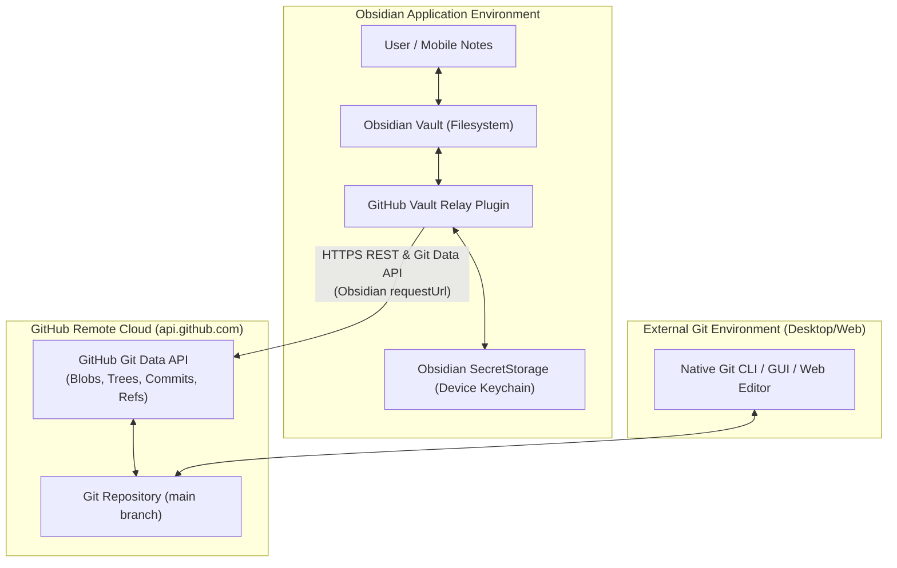
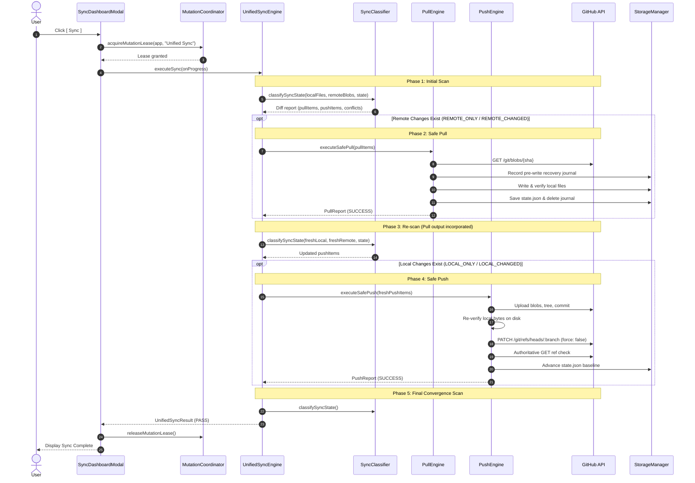
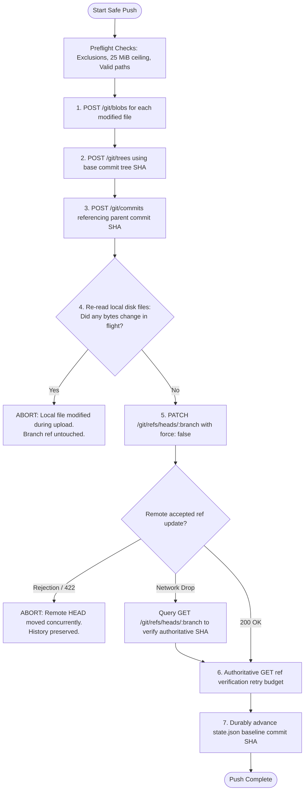
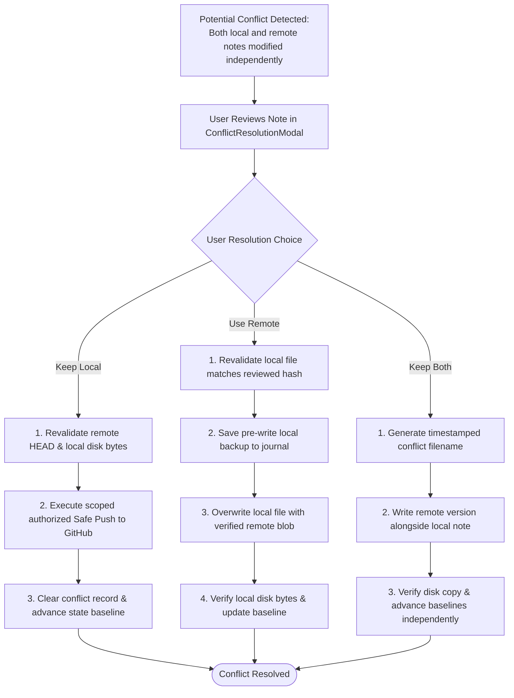
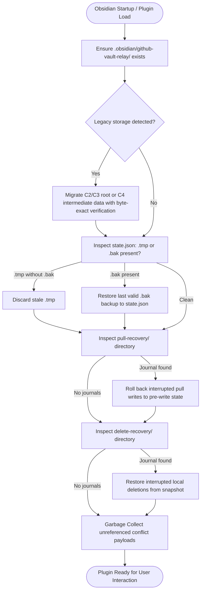
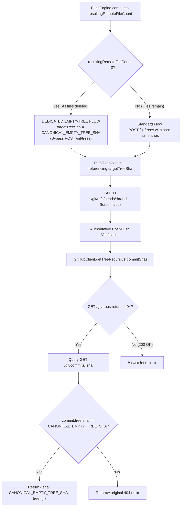

# GitHub Vault Relay: System Architecture

This document describes the technical architecture, data flows, and concurrency invariants of GitHub Vault Relay.

---

## 1. System Context



---

## 2. Component Architecture


---

## 3. Unified Sync Sequence



> [!IMPORTANT]
> **Non-Transaction Invariant**: Unified Sync is intentionally **not** an all-or-nothing rollback transaction. If Safe Pull succeeds and Safe Push subsequently fails (e.g. remote branch moved concurrently), the successfully pulled remote files are **not** rolled back. The partial success is reported truthfully to the user.

---

## 4. Safe Push Git Object Construction



---

## 5. Conflict Resolution Sequence



---

## 6. Crash Recovery & Storage Lifecycle



---

## 7. Safe Deletion & Move Lifecycle

### Three-Way Deletion Classification Matrix

| Baseline (`state.json`) | Local Vault | Remote GitHub | Classification | Engine Handling |
| :--- | :--- | :--- | :--- | :--- |
| Present (`SHA1`) | Absent | Present (`SHA1`) | `LOCAL_DELETED` | Safe Push builds tree with `sha: null`. Ref updated `force: false`. Baseline pruned after verified omission. |
| Present (`SHA1`) | Present (`SHA1`) | Absent | `REMOTE_DELETED` | Safe Pull creates pre-delete recovery snapshot, deletes local file via `vault.delete()`, prunes baseline. |
| Present (`SHA1`) | Absent | Absent | `DELETED` | Baseline entry pruned cleanly without remote or local mutation. |
| Present (`SHA1`) | Absent | Present (`SHA2`) | `DELETE_CONFLICT` | Local deleted vs remote modified. Halts safely; presents `[ Keep File ]` or `[ Delete File ]`. |
| Present (`SHA1`) | Present (`SHA2`) | Absent | `DELETE_CONFLICT` | Remote deleted vs local modified. Halts safely; presents `[ Keep File ]` or `[ Delete File ]`. |
| Absent | Present | Absent | `LOCAL_ONLY` | Conservative: never inferred as remote deletion without baseline proof. |
| Absent | Absent | Present | `REMOTE_ONLY` | Conservative: never inferred as local deletion without baseline proof. |

### Move & Rename Semantics

1. **Push Move**: A local file move (e.g. `Projects/A.md` -> `Archive/A.md`) is decomposed into `delete Projects/A.md` + `add Archive/A.md` within a **single atomic Git commit**.
2. **Pull Move**: Safe Pull enforces strict sequencing:
   - Step 1: Write and verify destination (`Archive/A.md`) byte-exact.
   - Step 2: Delete source (`Projects/A.md`) only after destination write is verified.
   - Step 3: Update baseline state and clean up recovery snapshots.
   If Step 1 fails, the source file remains untouched.
3. **Exact-SHA Detection**: When the SHA of an added local file exactly matches the baseline SHA of a deleted local file, the UI pairs them as an exact Move (`Projects/A.md → Archive/A.md`).
4. **Git Data API Safety**: All remote deletions use `{ path, mode: "100644", type: "blob", sha: null }` in `POST /git/trees`. Zero HTTP `DELETE` endpoints, zero `PUT /contents`, `force: false` always.

---

## 8. Canonical Empty-Tree & Zero-File Lifecycle

### GitHub Git Data API Edge Case
In Git, an empty directory tree is deterministically represented by the canonical empty tree SHA:
```
4b825dc642cb6eb9a060e54bf8d69288fbee4904
```
However, GitHub's Git Data API exhibits two edge-case behaviors:
1. Calling `POST /git/trees` with `{ tree: [] }` returns `HTTP 422 Invalid tree info`.
2. Calling `POST /git/trees` with a valid `base_tree` and deleting the final file (`{ path: "...", sha: null }`) returns `HTTP 404 Not Found`.
3. Calling `GET /git/trees/4b825dc642cb6eb9a060e54bf8d69288fbee4904` returns `HTTP 404 Not Found` because GitHub does not persist or serve a physical Git tree object for the empty root.

### Deterministic Architecture Solution
Vault Relay resolves this limitation cleanly without synthetic files (`.gitkeep`, `README.md`) or artificial placeholder commits:



### Transition Lifecycle: 0 ↔ 1+ Files
1. **Convergence to 0 Files**: When all synchronized files are removed locally, `PushEngine` commits `CANONICAL_EMPTY_TREE_SHA` directly. Post-verification confirms 0 files in the root tree, and `state.json` baseline is cleanly cleared of all file records.
2. **Transitioning from 0 to 1+ Files**: When a user creates the first file in an empty repository, `PushEngine` uploads the blob and calls `POST /git/trees` with `base_tree: CANONICAL_EMPTY_TREE_SHA` and the new file entry. GitHub natively accepts this call, builds a single-file tree, and the resulting commit advances the branch ref cleanly.
3. **Unborn Repository Boundary**: A repository must have at least one initial commit and branch. An unborn Git HEAD (0 commits) cannot be manipulated via Git Data API tree/commit endpoints; this is an inherent Git constraint documented in [README.md](../README.md).

