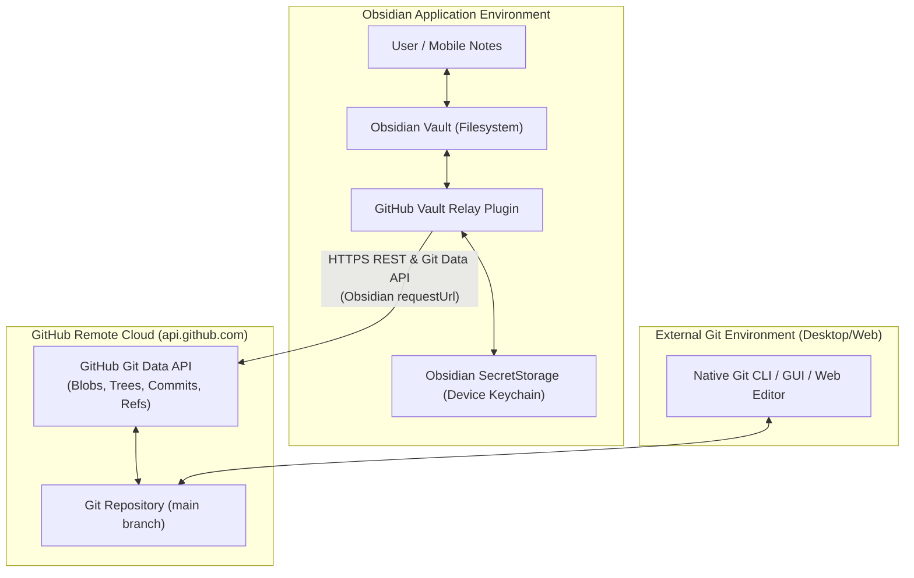
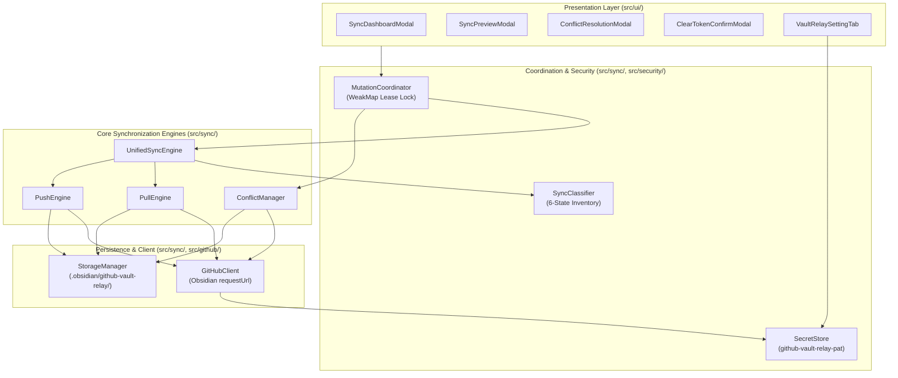
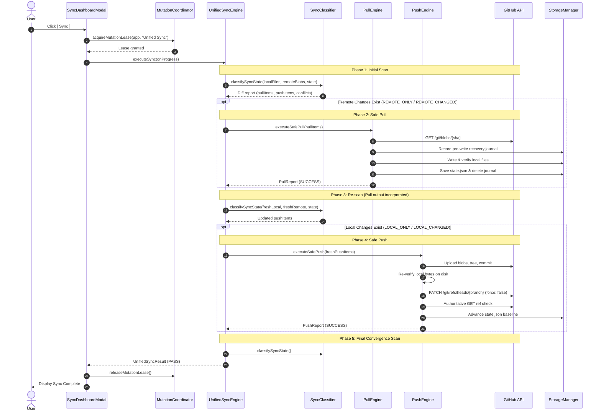
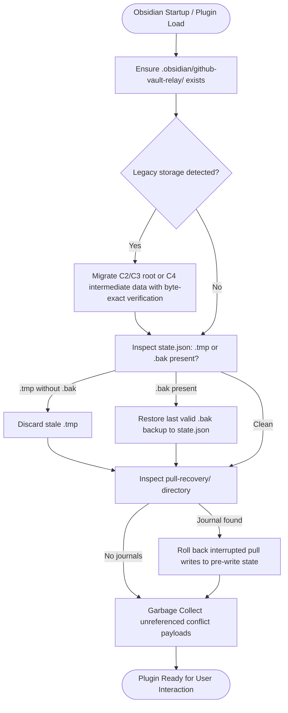

# GitHub Vault Relay: System Architecture

This document describes the technical architecture, data flows, and concurrency invariants of GitHub Vault Relay.

---

## 1. System Context



---

## 2. Component Architecture



---

## 3. Unified Sync Sequence



> [!IMPORTANT]
> **Non-Transaction Invariant**: Unified Sync is intentionally **not** an all-or-nothing rollback transaction. If Safe Pull succeeds and Safe Push subsequently fails (e.g. remote branch moved concurrently), the successfully pulled remote files are **not** rolled back. The partial success is reported truthfully to the user.

---

## 4. Safe Push Git Object Construction

```mermaid
flowchart TD
    Start([Start Safe Push]) --> Preflight[Preflight Checks: Exclusions, 25 MiB ceiling, Valid paths]
    Preflight --> Blobs[1. POST /git/blobs for each modified file]
    Blobs --> Tree[2. POST /git/trees using base_commit tree SHA]
    Tree --> Commit[3. POST /git/commits referencing parent commit SHA]
    Commit --> InFlightCheck{4. Re-read local disk files: Did any bytes change in flight?}
    InFlightCheck -- Yes --> AbortInFlight[ABORT: Local file modified during upload. Ref untouched.]
    InFlightCheck -- No --> PatchRef[5. PATCH /git/refs/heads/{branch} with force: false]
    PatchRef --> RefCheck{Remote accepted update?}
    RefCheck -- Rejection / 422 --> AbortMoved[ABORT: Remote HEAD moved concurrently. History preserved.]
    RefCheck -- Network Drop --> RecoverLost[Query GET /git/refs/heads/{branch} to verify authoritative SHA]
    RecoverLost --> VerifyRef
    RefCheck -- 200 OK --> VerifyRef[6. Authoritative GET ref verification retry budget]
    VerifyRef --> AdvanceState[7. Durably advance state.json baseline commit SHA]
    AdvanceState --> Done([Push Complete])
```

---

## 5. Conflict Resolution Sequence

```mermaid
stateDiagram-v2
    [*] --> PotentialConflict: Both local and remote notes changed independently
    PotentialConflict --> UserReview: Review in ConflictResolutionModal

    state UserReview {
        [*] --> Choice
        Choice --> KeepLocal: Select "Keep Local"
        Choice --> UseRemote: Select "Use Remote"
        Choice --> KeepBoth: Select "Keep Both"
    }

    state KeepLocal {
        KL_Revalidate: Revalidate remote HEAD & local file
        KL_Push: Scoped authorized Safe Push
        KL_Done: Clear conflict & advance baseline
        KL_Revalidate --> KL_Push --> KL_Done
    }

    state UseRemote {
        UR_Revalidate: Revalidate local file matches reviewed hash
        UR_Backup: Save pre-write local backup to journal
        UR_Write: Overwrite local file with remote blob
        UR_Verify: Post-write verification
        UR_Done: Clear conflict & advance baseline
        UR_Revalidate --> UR_Backup --> UR_Write --> UR_Verify --> UR_Done
    }

    state KeepBoth {
        KB_Name: Generate deterministic timestamped filename
        KB_Write: Write remote version as conflict copy
        KB_Verify: Verify conflict copy on disk
        KB_Done: Update baseline for both files independently
        KB_Name --> KB_Write --> KB_Verify --> KB_Done
    }

    KeepLocal --> Resolved: Conflict eliminated
    UseRemote --> Resolved: Conflict eliminated
    KeepBoth --> Resolved: Conflict eliminated
    Resolved --> [*]
```

---

## 6. Crash Recovery & Storage Lifecycle


