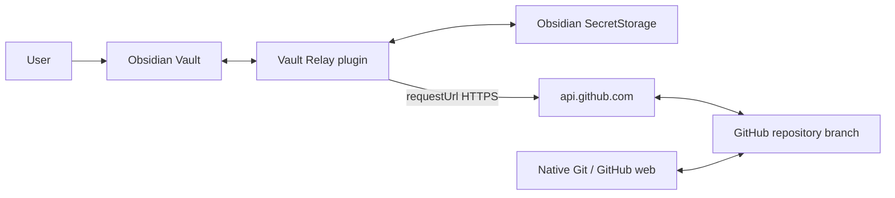
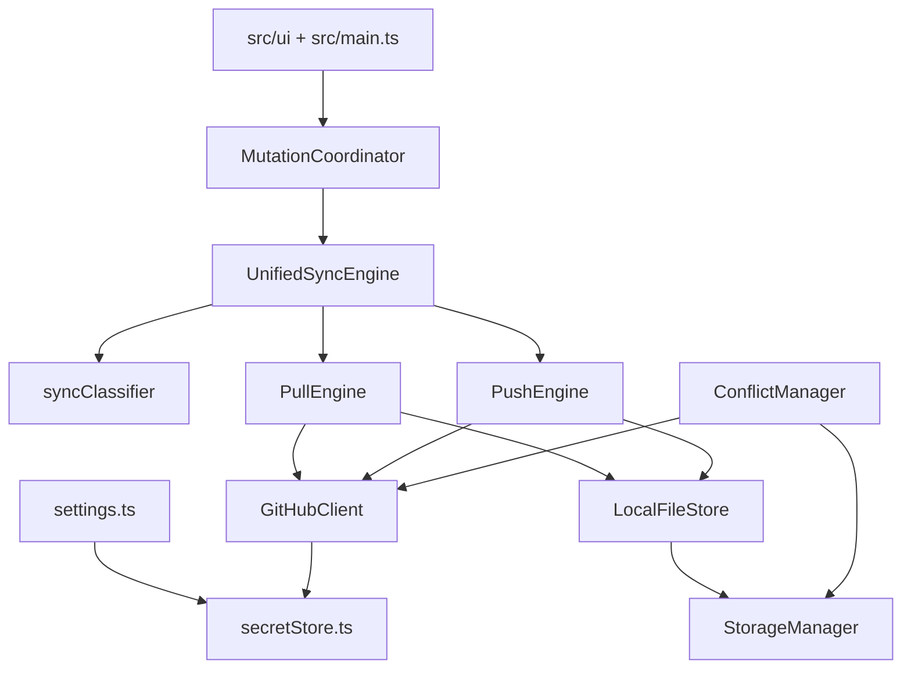
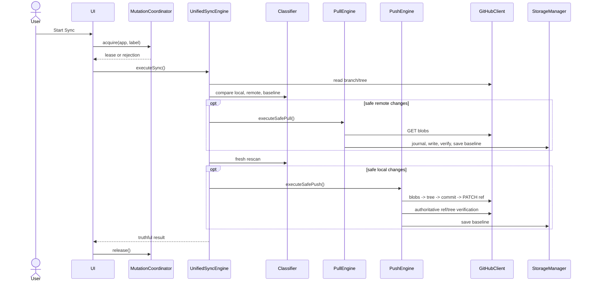

# GitHub Vault Relay: System Architecture

This document describes the architecture that exists in the current `1.0.6` source tree. File references are the evidence; diagrams are summaries, not a redesign proposal.

## System context



The plugin is an HTTPS bridge. It does not run Git or a Git emulator in the mobile runtime, and it does not assume exclusive ownership of the repository.

## Components



- `SyncEngine` scans local files, fetches the remote tree, and produces a preview report.
- `LocalFileStore` combines Vault/TFile access for visible files with `DataAdapter` enumeration and byte I/O for hidden user paths.
- `syncClassifier.ts` implements the ten `SyncCategory` states.
- `PullEngine` applies verified remote content and remote deletion/move operations.
- `PushEngine` creates Git objects and advances the branch safely.
- `UnifiedSyncEngine` sequences Pull, a fresh scan, Push, and final reporting.
- `ConflictManager` implements reviewed content/delete conflict actions.
- `StorageManager` owns internal state, payloads, recovery journals, migration, and atomic JSON replacement.
- `GitHubClient` owns HTTP, endpoint construction, retries, redaction, and Git Data API primitives.

## Unified Sync sequence



Unified Sync is deliberately not an all-or-nothing distributed transaction. A successful Pull remains applied if a later Push fails.

## Git object construction

Git stores content as blobs, directory listings as trees, history nodes as commits, and branch names as refs. The implemented Safe Push uses that model directly:

```text
local bytes
  -> POST /git/blobs
  -> POST /git/trees (base_tree = verified remote tree)
  -> POST /git/commits (parent = verified remote commit)
  -> PATCH /git/refs/heads/{branch} (force: false)
  -> GET ref + GET tree verification
  -> state.json baseline update
```

All eligible changes in one Safe Push are included in one commit/ref update boundary. A failed ref update does not advance local baseline state.

## Baseline, SHA, and classifier

`state.json` stores the last accepted commit and, per path, local/remote blob SHAs. `hashUtils.ts` computes the Git blob SHA-1 framing (`blob <length>\0<payload>`). `.md`, `.txt`, and `.canvas` content is canonicalized to LF before canonical hashing; other files are byte-exact.

The classifier compares local and remote entries against that baseline:

| State | Meaning |
| :--- | :--- |
| `LOCAL_ONLY` / `REMOTE_ONLY` | New content exists on one side without baseline proof |
| `LOCAL_CHANGED` / `REMOTE_CHANGED` | One side diverged while the other still matches baseline |
| `POTENTIAL_CONFLICT` | Both sides diverged, or differing content has no base |
| `UNCHANGED` | Canonical content matches, or both sides remain at the reviewed base |
| `LOCAL_DELETED` / `REMOTE_DELETED` | A baseline file disappeared from one side while the other still has baseline content |
| `DELETE_CONFLICT` | One side deleted and the other modified |
| `DELETED` | Both sides deleted a baseline path |

`OVERSIZED` and `UNSAFE` are guard counters, not classifier states.

## Safe Pull boundaries

Pull fetches and validates remote blobs before writes. Before changing a local file it:

1. checks the path and size policy;
2. verifies the remote blob's raw SHA;
3. canonicalizes text or preserves binary bytes;
4. writes a recovery journal and optional original backup;
5. writes and rereads the local file through Vault APIs or `DataAdapter`, according to path visibility;
6. updates `state.json` only when verification permits it;
7. removes recovery evidence after durable state handling.

For remote deletion, `StorageManager.beginDeleteRecovery()` snapshots and verifies the original bytes before trash runs. Visible files use `app.fileManager.trashFile()`; hidden files use `DataAdapter.trashLocal()` and never fall back to destructive hard delete. For an exact-SHA move, the destination is written and verified before the source is removed.

## Safe Push and optimistic concurrency

`PushEngine` uses the remote commit/tree observed during planning as the expected parent. It also rereads local files before the ref update to catch edits made while network calls were in flight. `GitHubClient.updateBranchRef()` rejects a caller request for `force: true` and always sends `force: false`.

After PATCH, Push performs an authoritative ref read and verifies the resulting tree/blob SHAs. If the PATCH response is lost, it checks the ref instead of guessing. Only after those checks does it update the local baseline.

The in-memory `MutationCoordinator` prevents reentrant Pull, Push, Unified Sync, and conflict operations in one Obsidian app instance. It is not a cross-device or cross-process lock.

## Conflict resolution

Content conflicts are preserved and reviewed in `ConflictResolutionModal`:

- Keep Local revalidates the remote branch/tree and performs a scoped `force: false` push.
- Use Remote revalidates local content, writes the reviewed remote version, verifies it, and updates the baseline.
- Keep Both keeps the local file and stores a verified remote conflict copy with independent metadata.

Delete conflicts use the same revalidation principle and expose Keep File, Delete File, or Cancel. No conflict is silently resolved by the classifier.

## Empty-tree and deletion flow

For a resulting remote file count of zero, `PushEngine` uses `CANONICAL_EMPTY_TREE_SHA` (`4b825dc642cb6eb9a060e54bf8d69288fbee4904`) directly instead of creating an empty tree through the GitHub endpoint. Creating the first file from that state uses the canonical SHA as `base_tree`. This supports an existing repository converging to zero files without `.gitkeep`; an unborn repository still requires an initial commit/branch.

Remote deletion is represented in a tree update, not an HTTP DELETE. A local remote-delete pull is sent through Obsidian trash after the recovery snapshot. Deletion requires baseline proof and a user-triggered sync/confirmation boundary.

## Internal storage and recovery

The canonical path is computed at runtime:

`${app.vault.configDir}/github-vault-relay/`

The usual `.obsidian/github-vault-relay/` spelling is only an example. The directory contains:

```text
state.json
conflicts_meta.json
conflicts/
pull-recovery/
delete-recovery/
```

State and metadata use `.tmp` staging and `.bak` fallback recovery. Startup runs legacy migration, atomic-file recovery, interrupted Pull recovery, interrupted Delete recovery, and orphan conflict cleanup.

`StorageManager` and all scan/filter flows use the live `app.vault.configDir`. The `.obsidian` value in `pathFilter.ts` is only a fallback for utility calls without an `App`; runtime settings and engine constructors always add the active config directory. The positive reserved policy excludes the live config directory, `.git/`, `.trash/`, and `_fit/`; `.agents/`, `.vscode/`, other user dot-folders, and `_vault-relay/` are syncable.

## Network and security boundaries

- HTTP goes through Obsidian `requestUrl()` to `https://api.github.com`.
- Reads include repository/branch/ref/tree/blob operations; writes use only Git Data API blobs, trees, commits, and refs.
- Mutations do not use GitHub `DELETE` endpoints or `PUT /contents`.
- PAT storage is `SecretStorage` only at runtime, key `github-vault-relay-pat`.
- The 25 MiB per-file ceiling is a Vault Relay safety policy, not GitHub's platform limit.
- Path safety checks reject traversal, absolute/control paths, excluded paths, and unsafe collisions.
- Sanitized error paths use `redact.ts`; production diagnostic warnings and user-facing caught-error notices pass through the same sanitizer.

## Community compatibility in the current source

`settings.ts` exposes declarative setting definitions for Obsidian `>=1.13.0`, including a rendered asynchronous repository selector and `visible`-guarded Advanced Settings, and retains synchronous `display()` compatibility for the manifest minimum `1.11.4`. Runtime feature detection is used for newer button styling APIs. The source tests document these compatibility choices; they do not change the sync model.
